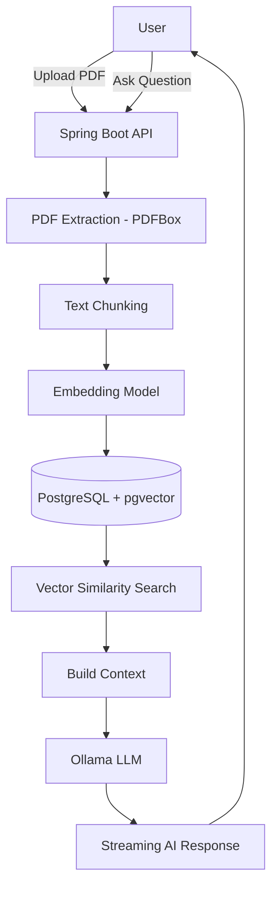

# 📄 AI Document Assistant (RAG System)

An AI-powered backend system that allows users to upload PDF documents and ask questions about them using a Large Language Model.

The application extracts text from documents, converts it into vector embeddings, stores them in a vector database, and retrieves relevant information to answer user questions.

This project demonstrates a **Retrieval Augmented Generation (RAG)** architecture built using modern AI backend technologies.

---

# 🚀 Features

- Upload PDF documents
- Extract text from uploaded PDFs
- Split documents into smaller chunks
- Generate vector embeddings
- Store embeddings in a vector database
- Perform semantic search using vector similarity
- Ask questions about uploaded documents
- AI generates answers using relevant document context
- Streaming AI responses using Server-Sent Events
- JWT based authentication

---

# 🧠 AI Architecture (RAG)

This system uses **Retrieval Augmented Generation** to answer questions from documents.

User Question  
↓  
Generate Question Embedding  
↓  
Vector Similarity Search  
↓  
Retrieve Relevant Document Chunks  
↓  
Send Context + Question to LLM  
↓  
Generate AI Answer  

---

# 🏗 System Architecture



# Tech Stack

## Backend
- Spring Boot
- Spring AI

## AI Models
- Ollama
- Llama 3 (LLM)
- nomic-embed-text (embedding model)

## Database
- PostgreSQL
- pgvector (Vector search extension)

## Document Processing
- Apache PDFBox

## Tool
- Docker
- IntelliJ IDEA

# API Endpoints

## Register User
```
POST /api/auth/register
```
## Login User
```
POST /api/auth/login
```
## Upload Document
```
POST /api/doc_assistant/upload
```
## Get Uploaded File
```
GET /api/doc_assistant/file
```
## Download Uploaded File
```
GET /api/doc_assistant/download
```
## Extract Downloaded File
```
GET /api/doc_assistant/extract
```
## 
